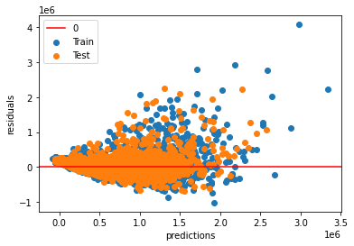

# Housing Data Project

# Business Understanding 

We have been hired by the Danielson family to help find them an affordable home in King County Washington. In the data frame we analyzed, there were over 20,000 homes to choose from. Our job is to make it easier for them to find a house in King County. We made several regression models to find a strong correlation with price and plugged in different variables to find the best way to predict the price on the house. Our target price is to find a home around \\$450,000 and it will need to have 3 to 5 bedrooms. We filtered our data we ran in our model to only look at houses with 3 to 5 bedrooms so that our model does not have to go through over 20,000 pieces of data. 

# Data Understanding 

We pulled our information from a data frame that had all the houses in King County Washington. Since we were looking to find a home for a family of four, we filtered our data to only look at houses that had 3 to 5 bedrooms. The data set described many features of the house, but we were only interested in variables that affected a house's price. The variables that we focused on were bedrooms, bathrooms, grade, square feet of living space, square feet of living space, square feet above the first floor, house age, and zipcode. One of the limitations on our model is that it is inaccurate when predicting price on homes that have bedrooms outside the range of 3 to 5. 

# Methods 

We created a linear regression model that uses bedrooms, bathrooms, grade, square feet of living space, square feet of living space, square feet above the first floor, house age, and zipcode to predict price. 

